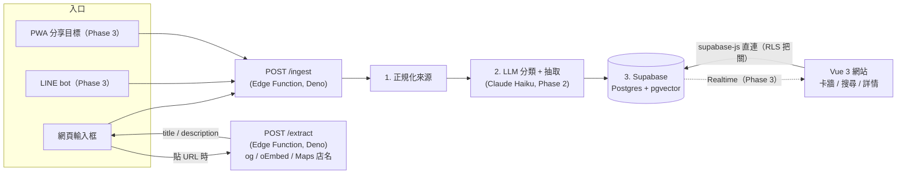
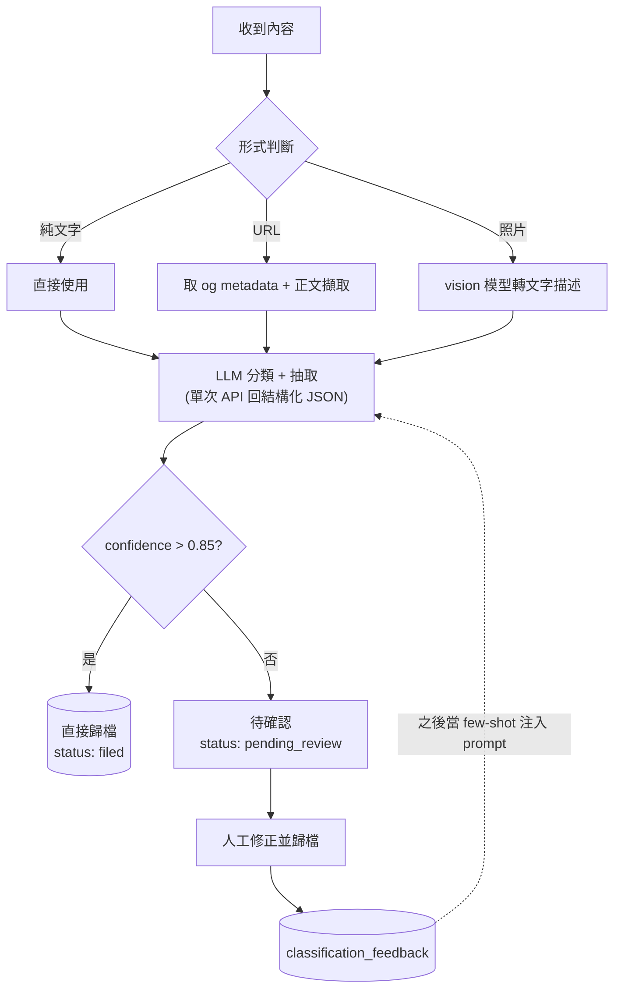

# Architecture

> 圖是流程的 single source of truth。改架構先改本檔的 Mermaid,再改 code。
> 單張圖 ≤ 25 節點;語法由 AI 生成、人審。

## 系統架構

所有入口共用同一個 `/ingest`;核心邏輯只有一份,新增入口只是多一個轉接層。
URL metadata 擷取走獨立的 `/extract`(貼連結自動填標題+餵分類評分)。

**邊界說明**

- 前端(`apps/web`)透過 `supabase-js` 直接讀寫 Postgres;RLS 是安全邊界(見 `security-guideline.md`)。
- 伺服端路徑有兩條:
  - `/ingest`——要拿 `ANTHROPIC_API_KEY` 呼叫 Claude,key 不能進前端。
  - `/extract`——瀏覽器 CORS 抓不到別人網頁,必須 server 端 fetch;登入才可用。
    SSRF 防護與 deadline 規格見 `docs/proposals/link-meta-no-ai.md`(H1/H2)。
- `/extract` 是加值不是前提:mock 模式 / 擷取失敗一律 fail-soft 回 null,照原樣存。
- 入口即模組:LINE bot / PWA 只負責「接住內容 + 呼叫 /ingest」,不含分類邏輯。

## Ingest pipeline(Phase 2 目標流程)

## 目前實作狀態

| 節點 | 狀態 |
|---|---|
| Vue 3 網站(卡牆 / 搜尋 / 詳情 / CRUD) | ✅ Phase 1 |
| supabase-js 直連 + RLS | ✅ Phase 1(anon session,見 security-guideline) |
| `/ingest` Edge Function | 🟡 骨架(寫入 pending_review,LLM 未接) |
| `/extract` Edge Function(og / oEmbed / Maps → 標題自動填 + 分類評分) | 🟡 已實作,SSRF / deadline 強化中(proposals/link-meta-no-ai.md),**未部署** |
| LLM 分類 + 信心分流 | ⬜ Phase 2(現行替代:規則分類器 + 自學字典,見 ai-strategy.md) |
| URL 正文擷取 / vision | ⬜ Phase 2(metadata 已由 /extract 覆蓋;正文 / vision 未做) |
| pgvector 語意搜尋 / Realtime | ⬜ Phase 3 |
| Collections | ✅ 2026-07-15(entry 引用制,見 ai-strategy.md) |
| links / graph view | ⬜ Phase 4 |
