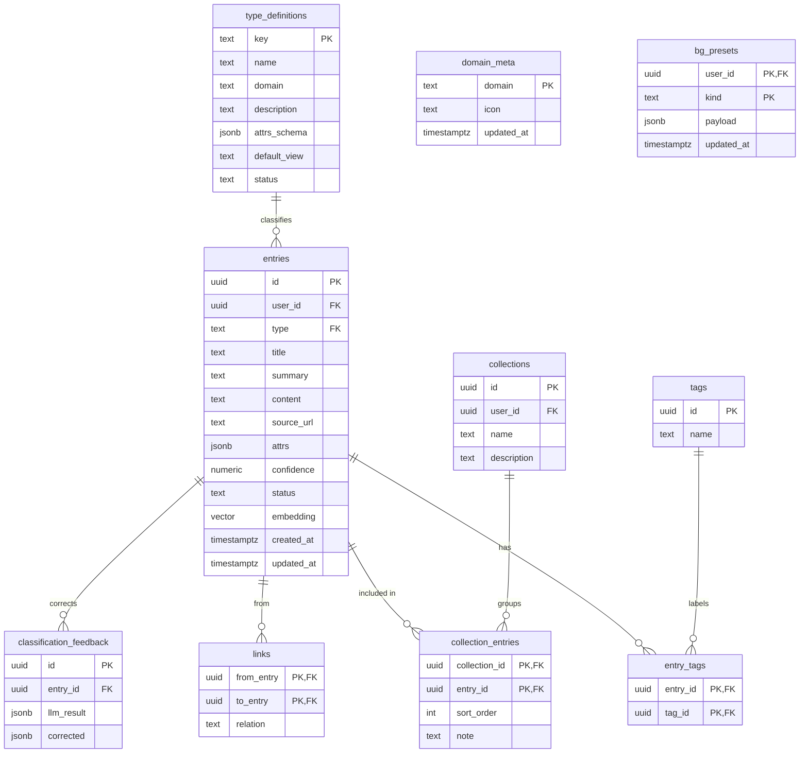

# Data Model

> 正本 SQL 在 [`supabase/migrations/`](../supabase/migrations/)。本圖與 migration 同步——改 schema 先改圖再寫 migration。
> 「現在實際有哪些表」也可直接看 Supabase Dashboard → Table Editor。

## 資料表清單(2026-07-14 同步至 0010)

| 表 | 用途 | 建立於 |
|---|---|---|
| `type_definitions` | 分類定義(大類別/子類別,類型當資料管理) | 0001 |
| `entries` | **唯一內容體**:每筆收藏的知識/連結 | 0001 |
| `tags` / `entry_tags` | 標籤與多對多關聯(0005 加 hidden) | 0001 |
| `collections` / `collection_entries` | 主題集合(行程、清單),只引用 entry id(0011 擁有者化) | 0001 |
| `links` | entry 之間的關聯 | 0001 |
| `classification_feedback` | 分類修正紀錄(自學權重進 DB 的預留地) | 0001 |
| `domain_meta` | 大類別自訂 icon 等裝飾資料 | 0008 |
| `bg_presets` | 活背景方案存檔(每人每種背景一列,payload JSONB) | 0010 |
| `category_counts`(view) | 各分類項目數統計(非表,查詢用視圖) | 0004 |

## ER Diagram

(`domain_meta`、`bg_presets` 是獨立設定表,不與 entries 關聯。)

## 設計要點

- **entry 是唯一內容體**。其他表都是「組織 / 引用 entry 的方式」,不複製內容。
- **type_definitions 把類型當資料管理**:`description` 是 LLM 分類依據,`attrs_schema` 同時是 LLM 抽取規格與前端的動態表單 schema。新增類型 = 插一筆資料,零程式碼。
- **`attrs_schema` 格式**:`{"欄位名": "string"}` 或 `{"欄位名": "enum:選項1/選項2"}`。前端 `parseAttrField()` 依此渲染文字框或下拉。
- **`embedding vector(384)`**:對應 gte-small(Phase 3)。換 embedding 模型(如 OpenAI 1536)要連同此維度一起改並重算。
- **confidence 分流**:`> 0.85 → filed`,否則 `pending_review`。
- **RLS**:使用者資料表(entries 等)以 `auth.uid() = user_id` 綁定;細節見 `security-guideline.md`。

## Migration 檔

| 檔案 | 內容 |
|---|---|
| `0001_schema.sql` | 八張表 + pgvector extension + updated_at trigger |
| `0002_seed_type_definitions.sql` | 六筆種子類型(food / attraction / travel_info / ai_skill / frontend_snippet / backend_skill) |
| `0003_rls.sql` | Row Level Security policies |
| `0004_sort_order_and_category_authoring.sql` | type_definitions 加 sort_order/color、entries 加 sort_order、category_counts view |
| `0005_tags_hidden.sql` | tags 加 hidden(隱藏不刪除) |
| `0006_entries_closed.sql` | entries 加 closed(結案狀態) |
| `0007_seed_user_taxonomy.sql` | 使用者 63 分類種子資料 |
| `0008_domain_meta.sql` | domain_meta 表(大類別自訂 icon) |
| `0009_unique_category_name.sql` | 同大類別下分類名唯一索引 + 去重(餐酒館事件的真防線) |
| `0010_bg_presets.sql` | bg_presets 表(活背景方案存檔 + RLS) |
| `0011_collections_owner_rls.sql` | collections 加 user_id + policy 改擁有者限定(原 authenticated 全放行是 MVP 簡化) |
