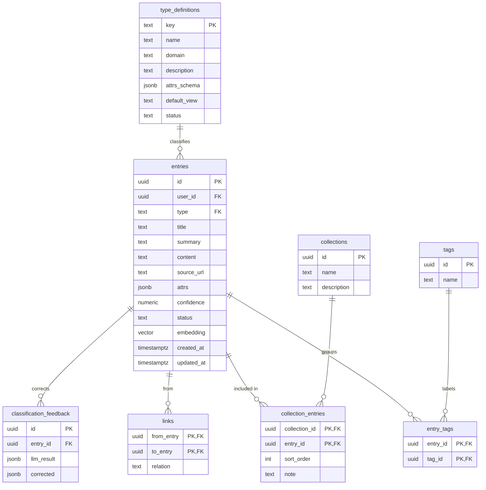

# Data Model

> 正本 SQL 在 [`supabase/migrations/`](../supabase/migrations/)。本圖與 migration 同步——改 schema 先改圖再寫 migration。

## ER Diagram

## 設計要點

- **entry 是唯一內容體**。其他表都是「組織 / 引用 entry 的方式」,不複製內容。
- **type_definitions 把類型當資料管理**:`description` 是 LLM 分類依據,`attrs_schema` 同時是 LLM 抽取規格與前端的動態表單 schema。新增類型 = 插一筆資料,零程式碼。
- **`attrs_schema` 格式**:`{"欄位名": "string"}` 或 `{"欄位名": "enum:選項1/選項2"}`。前端 `parseAttrField()` 依此渲染文字框或下拉。
- **`embedding vector(384)`**:對應 gte-small(Phase 3)。換 embedding 模型(如 OpenAI 1536)要連同此維度一起改並重算。
- **confidence 分流**:`> 0.85 → filed`,否則 `pending_review`。
- **RLS**:使用者資料表(entries 等)以 `auth.uid() = user_id` 綁定;細節見 `security-guideline.md`。

## Migration 檔

| 檔案 | 內容 |
|---|---|
| `0001_schema.sql` | 八張表 + pgvector extension + updated_at trigger |
| `0002_seed_type_definitions.sql` | 六筆種子類型(food / attraction / travel_info / ai_skill / frontend_snippet / backend_skill) |
| `0003_rls.sql` | Row Level Security policies |
