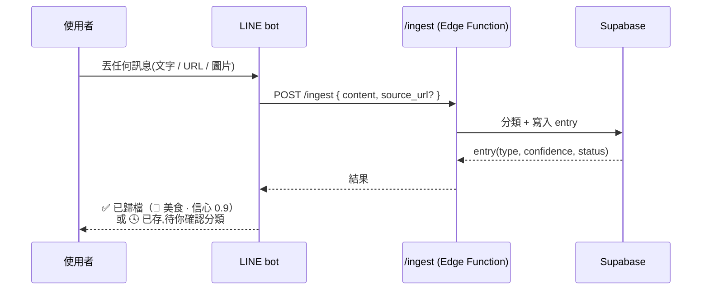

# LINE Bot Flow(Phase 3 — 只設計不刻)

> LINE bot 是 `/ingest` 的另一個入口。入口即模組:只負責「接住內容 + 呼叫 /ingest」與「查詢回覆」,不含分類邏輯(全在 Edge Function)。

## 輸入流程(存資料)

隨手丟 = 存。回覆用 emoji + 一行結果;待確認時附「用 /pending 查看」。

## 輸出流程(查資料)

使用者用指令查詢現有資訊,簡易排版 + icon 美化:

| 指令 | 功能 | 回覆 |
|---|---|---|
| `/help`、「說明」 | 指令列表引導 | 快速上手卡(見下) |
| `/cats` | 列所有分類 + 筆數 | `🍜 美食(12) 📍 景點(8) 🤖 AI(20)…` |
| `/list <分類>` | 該分類最近項目 | 每筆:icon + 標題 + 摘要 |
| `/find <關鍵字>` | 關鍵字搜尋 | 命中列表 |
| `/pending` | 待確認佇列 | 待核准項目 + 建議分類 |
| `/get <id>` | 單筆詳情 | 完整欄位 |

排版用 LINE Flex Message(卡片 / 按鈕)或文字 + emoji;每個類型固定 icon(🍜 美食、📍 景點、🤖 AI、🎨 前端…,取自 `type_definitions.icon`)。

## 引導(必做)

- **首次加好友** + `/help`:推「快速上手卡」列出可用指令與範例。
- **常駐 Rich Menu**:放常用鈕(最近、待確認、搜尋、分類)+「說明」。
- 指令錯誤 → 回友善提示並附 `/help`。

## 安全

- webhook 驗 LINE signature。
- 寫入用 service key(伺服端),不經前端。
- 對應多入口的 RLS / 物件層權限見 `security-guideline.md` 與 PLAN §7.1。
